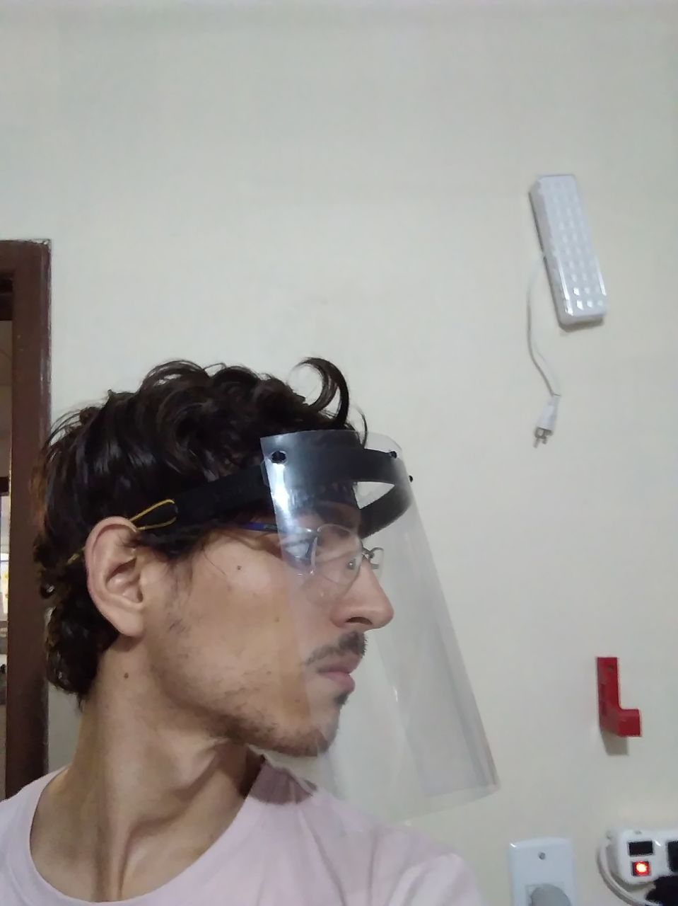
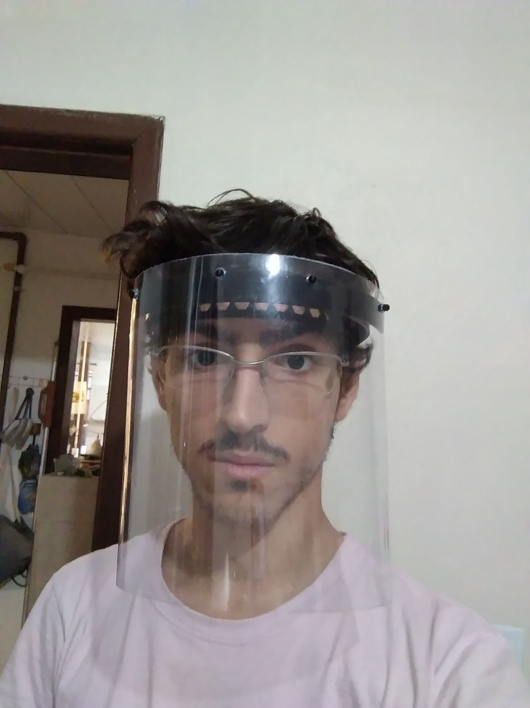

# Mascara modelo "Prusa"
Modelo original prusa

 

## Arquivos
- [Suporte superior (.stl)](covid19_headband_rc2.stl)
- [Suporte inferior (.stl)](bottom_reinforcement.stl)
- [Desenho de corte (.dxf)](shield_final.dxf)

## Vantagens
- Ja validada por instituiçoes de saude
- Confortavel
- Firme

## Desvantagens
- Impressao demorada (6h)
- Pouco material (40g de filamento)

## BOM
- Suporte superior (impresso)
- Suporte inferior (impresso)
- Folha de acetato 24x24cm (0.5mm de espessura)
- Elastico

## Instruçoes para confecçao

- Imprimir os suportes
- Encaixar a folha de acetato
- Prender o elastico

## Configuraçao de impressao
- Numero de perimetros: 3;
- Percentual de infill: 20%;
- Altura de camada: 0.22mm;
- Velocidade planar: 60 mm/s;

## Limpeza
(?)

## Referencia
https://blog.prusaprinters.org/from-design-to-mass-3d-printing-of-medical-shields-in-three-days/
