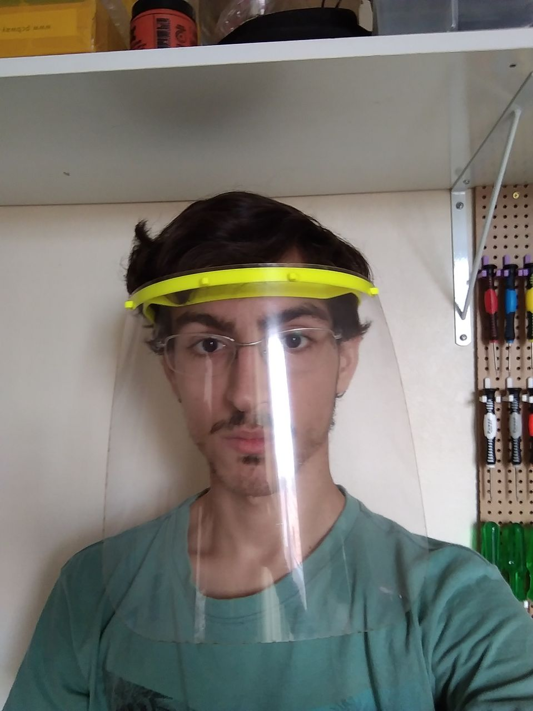
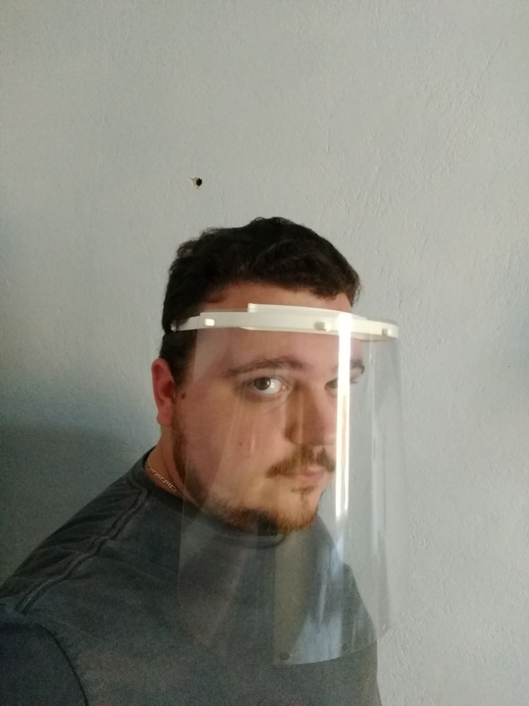
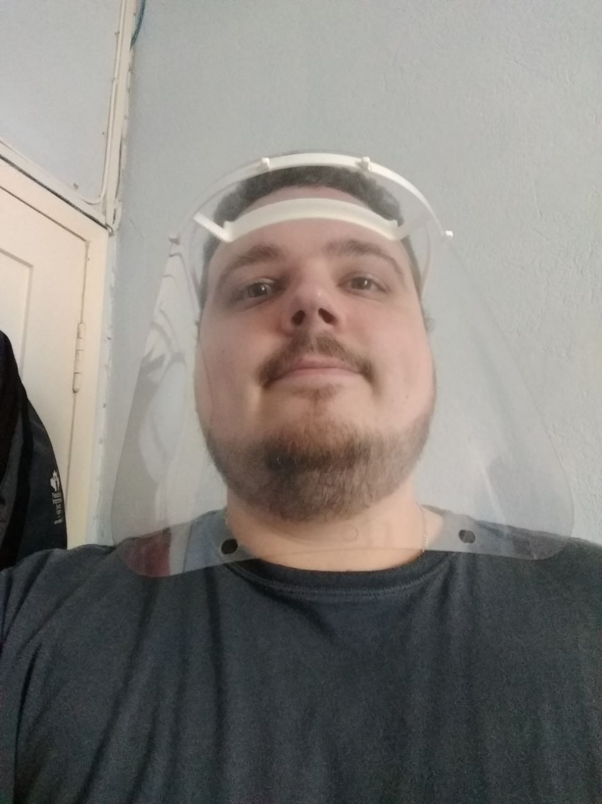

# Mascara modelo Prusa Remix Lasoft
Mascara de produção rapida e confortavel 

  

## Arquivos
- [Suporte superior (.stl)](single-face-shield-lasoft-modified.stl)

## Vantagens
- Impressao rapida (1:30h)
- Pouco material (10g de filamento)

## Desvantagens
- Encaixe do acetato é quadrado

## BOM
- Suporte superior (impresso)
- Folha de acetato 24x24cm (0.5mm de espessura)
- Elastico

## Instruçoes para confecçao

- Imprimir os suportes
- Encaixar a folha de acetato
- Prender o elastico

## Configuraçao de impressao
- Numero de perimetros: 3;
- Percentual de infill: 20%;
- Altura de camada: 0.22mm;
- Velocidade planar: 60 mm/s;

## Limpeza
(?)

